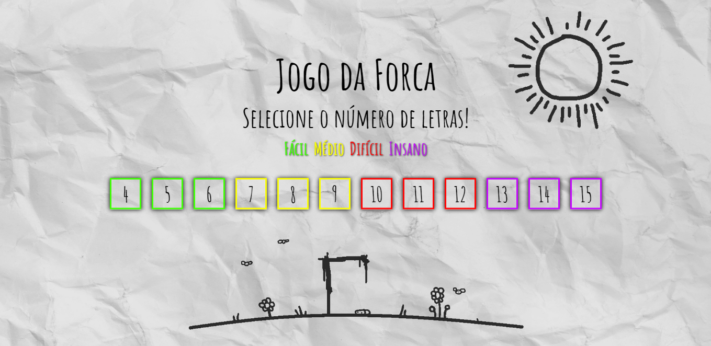
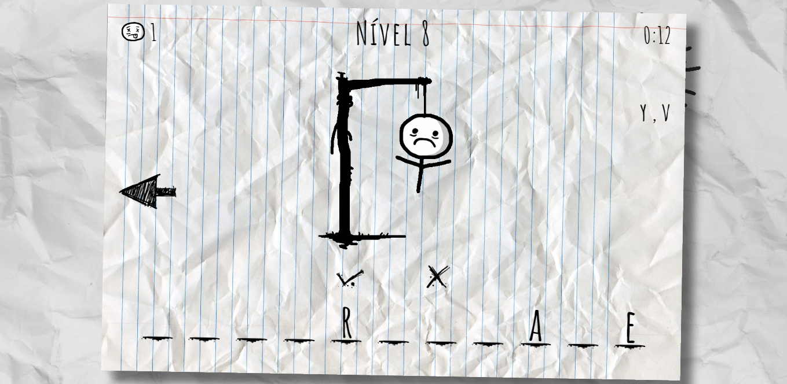
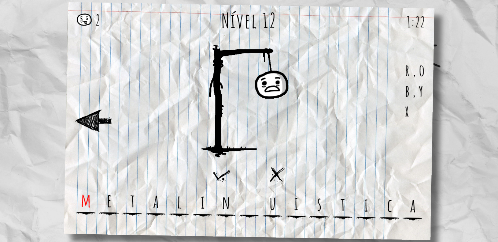

# Jogo da Forca ☠️

### Introdução

#### O projeto consiste na recriação do jogo da forca utilizando JavaScript, com todas as animações e sistema feitos por mim. Com 12 níveis disponíveis separados em fácil, médio, difícil, e insano.
#### (caso tenha jogado em uma versão anterior, clique no sol do menu para resetar e recarregar as palavras novas) 

#### Para jogar, tente acertar a palavra oculta, guiando-se apenas por seu tamanho. Digite uma letra do alfabeto para tentar acertar uma letra, caso esteja acerta ela é escrita no espaço correspondente. Cada nível tem sua própria lista de palavras, que é atualizada após um nível bem sucedido, e também seu limite de erros baseado na dificuldade escolhida. (Acentos e cedilhas são ignorados)

### Menu 

### Em jogo

